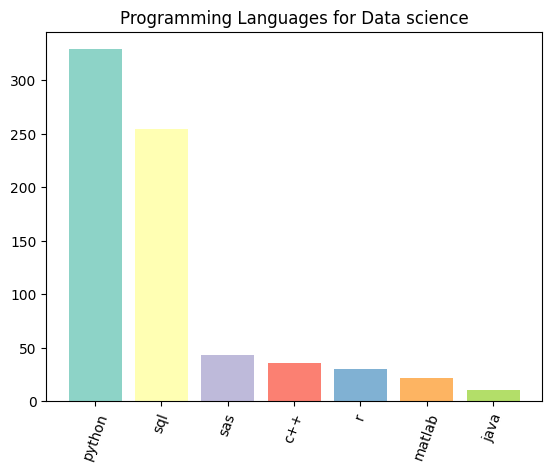
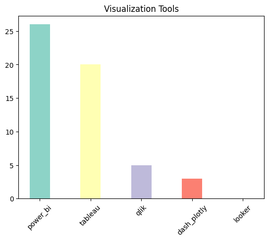
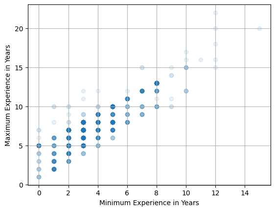
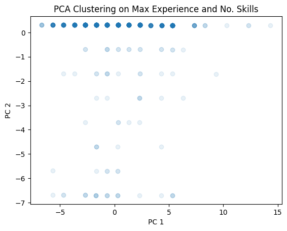

# Data Science Job Market Analysis

## Project Overview

This project analyzes the Data Science job market in India using data scraped from [Naukri.com](https://www.naukri.com/).  
It includes the following pipeline:

1. Web scraping of job postings using Selenium.
2. Data cleaning and preprocessing.
3. Exploratory Data Analysis (EDA) to uncover job market trends.

## Dependencies:
- `Python 3.8+`
- `matplotlib`
- `pandas`
- `selenium`

## Step-by-Step Instructions
Ensure you have Python 3.8+ installed.

### Step 1: Set up the Virtual Environment
You can set up your environment using **one of the following methods**:

####   🔸 Option A: Using `venv` (recommended)

```bash
python -m venv myenv
source myenv/bin/activate    # On Windows: myenv\Scripts\activate
pip install --upgrade pip
pip install -r requirements.txt
```

####   🔹 Option B: Using conda

```bash
conda create -n myenv python=3.8
conda activate myenv
pip install -r requirements.txt
```
See the <a href="EnvSetupGuide.pdf" target="_blank">setup-guide</a> for further explenation.

### Step 2: Run the Scraper.ipynb
Open `Scraper.ipynb` file using either Method A or Method B.

####   🔸 Method A: Using VSCode (recommended)

> I- Install [VSCode](https://code.visualstudio.com/download) and open it.

> II- Use File > Open Folder to open the project folder.

> III- In the Explorer (🗎 icon on the top left), open `Scraper.ipynb`.

> IV- Select the correct virtual environment. See the <a href="EnvSetupGuide.pdf" target="_blank">setup-guide</a> to activate the environment in VSCode.
  
> V- Run the script.

####   🔹 Method B: Using the Jupyter Notebook Web Interface

> I- Launch the notebook using this command:

```bash
# Run from terminal
jupyter notebook scraper.ipynb
```
> II- Open the file `Scraper.ipynb` through the browser.

> III- Select the correct environment kernel. See the <a href="EnvSetupGuide.pdf" target="_blank">setup-guide</a> to activate enviroment in Jupyter.

> IV- Run the script.

This code scrape job listings from Naukri.com. And output `data_scientist_jobs.csv` will be created with raw job listings.

### Step 3: Clean the Data
Open and run the analysis.ipynb notebook. This step involves:

  - Removing duplicates

  - Handling null values

  - Formatting job roles skills information. More specifically, we standardize columns containing textual data to uniformly store lower-case strings. We will also use regular expressions to conform variations in the way a specific skill may be listed, such as with abbreviations ('machine learning' &rarr; 'ml').

  - Add new features: we will add a new feature that counts the total number of skills listed. We'll also add a new column that holds "Minimum Desired Experience" and "Maximum Desired Experience". These will give us some more numerical data to work with when performing exploratory data analysis (EDA). 

### Step 4: Perform EDA
Continue in the same notebook to:

  - Visualize common job titles, skills, locations, and companies.

  - Uses matplotlib for plotting insights.

  Here are some sample figures that are produced.

  
  


### Step 5: Cluster the locations of the jobs
We'll continue in the same notebook to:

  - clean job locations into neat strings

  - convert strings to numeric vectors

  - since numeric vectors are high dimensional, reduce their dimensions

  - plot the PCA and UMAP coordinates of the locations and see how they are grouped together
  - each data point is a location. Grouped clusters are similar locations

### Step 6: Cluster based on Experience Levels and Skills

We'll continue in the same notbook to:

  - plot the PCA clusters when using various combinations from the three numerical columns: minimum experience, maximum experience, and total number of listed skills. 
  - interpretations for each example are provided in the analysis notebook.

  Below are some example figures that show the relationship between minimum and maximum expereince, and the results from PCA clustering when we reduce to 3 principal components from our three numerical columns. 

  
  

